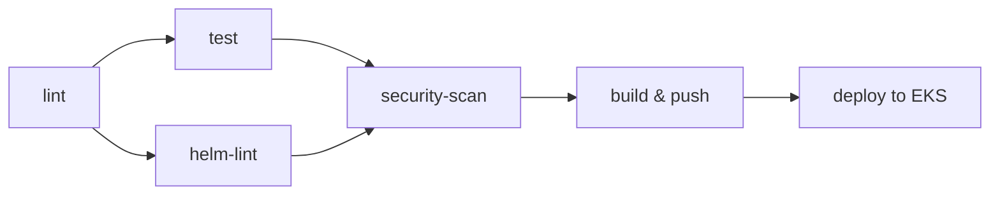

# IP App

A simple Flask application that returns the visitor's IP address, containerized and deployed to EKS via GitHub Actions.

## Image Registry

Images are published to **GHCR** (GitHub Container Registry):

```
ghcr.io/forthexp/ip-app
```

Each commit on `main` produces:
- `sha-<commit>` — unique SHA tag
- `main` — branch tag
- `latest` — latest `main` build

## CI/CD Pipeline

The pipeline (`.github/workflows/main.yml`) runs on every push/PR to `main`:



| Stage | What it does |
|---|---|
| **lint** | Ruff check + format check on `app/` |
| **test** | Install deps, run `pytest` |
| **helm-lint** | `helm lint` + `helm template` validation |
| **security-scan** | Trivy scans for HIGH/CRITICAL CVEs (fail on any) |
| **build** | Multi-arch build (`linux/amd64`, `linux/arm64`) with Docker Buildx, push to GHCR |
| **deploy** | OIDC auth to AWS, update kubeconfig, `helm upgrade --install`, rollout verify, smoke test |

### Deploy job details

1. **Authenticate to AWS** via OIDC using the configured IAM role
2. **Update kubeconfig** for the EKS cluster
3. **Helm install/upgrade** with image SHA tag from the build stage
4. **Verify rollout** — `kubectl rollout status`
5. **Smoke test** — curl `/health`, `/ready`, and `/` through the Ingress endpoint
6. **Commit status notification** — sets a `deploy/eks` success/failure status on the commit via `actions/github-script`

## Local Development (kind/minikube)

```bash
# Create a local cluster
kind create cluster --name ip-app

# Build the image
docker build -t ip-app:latest .

# Load into kind
kind load docker-image ip-app:latest --name ip-app

# Install the chart with local overrides (no ingress, local image)
helm upgrade --install ip-app ./charts \
  --namespace ip-app \
  --create-namespace \
  --values charts/values.local.yaml

# Port-forward to test
kubectl port-forward deployment/ip-app 5000:5000 -n ip-app
curl http://localhost:5000/
```

## Secrets Management

All sensitive values are stored in **GitHub Secrets** and never hardcoded in the repository:

| Secret | Purpose |
|---|---|
| `AWS_ACCOUNT_ID` | AWS account for EKS and OIDC role ARN |
| `AWS_REGION` | EKS cluster region |
| `AWS_IAM_ROLE_NAME` | IAM role assumed via OIDC |
| `EKS_CLUSTER_NAME` | Target EKS cluster name |

Kubernetes secrets can be injected via the chart's `secrets.envFrom`:

```yaml
secrets:
  envFrom:
    - secretRef:
        name: ip-app-secret
```

## Image Scanning & SBOM

Every build is scanned with **Trivy** in CI:

- **Severity threshold**: HIGH and CRITICAL only
- **Exit on finding**: `exit-code: 1` — any HIGH/CRITICAL CVE fails the build
- **SBOM**: Generated automatically by Trivy during the scan step
